# Somnia Database — Updated ERD (v1.3.0)

This document presents the full Somnia database schema after applying the v1.3.0 manufacturing extension. Seven new modules have been added on top of the existing v1.2.0 schema: Bill of Materials, Manufacturing Routing, Machine Management, Quality Control, Inventory Movements, Production Planning, and Material Requirement Planning.

Diagrams use Mermaid `erDiagram` syntax. Entity names with spaces are double-quoted.

---

## 1. Existing Schema Overview (v1.2.0)

The v1.2.0 base covers product cataloging, supply chain, logistics, customs, labor, financials, a scenario/calculation engine, and core operations (purchase orders, shipments, inventory, production batches, finished goods).

```mermaid
erDiagram
  %% ═══════════════════════════════════════════
  %% IDENTITY
  %% ═══════════════════════════════════════════
  USER {
    string id PK
    string email
    string role
  }

  %% ═══════════════════════════════════════════
  %% PRODUCT CATALOG
  %% ═══════════════════════════════════════════
  PRODUCT {
    string id PK
    string name
    string category
  }
  PRODUCT_SPEC_VERSION {
    string id PK
    string productId FK
    string versionLabel
    datetime validFrom
    datetime validTo
  }
  PRODUCT_SIZE {
    string id PK
    string productId FK
    string sizeLabel
    decimal rawMaterialQuantityPerUnit
  }

  %% ═══════════════════════════════════════════
  %% SUPPLY CHAIN
  %% ═══════════════════════════════════════════
  SUPPLIER {
    string id PK
    string companyName
    string country
  }
  SUPPLIER_CAPABILITY {
    string id PK
    string supplierId FK
    string productSpecVersionId FK
  }
  SUPPLIER_QUOTE {
    string id PK
    string supplierId FK
    string productSpecVersionId FK
    decimal pricePerM2
    string currency
  }
  SUPPLIER_SCORE {
    string id PK
    string supplierId FK
    string productSpecVersionId FK
    decimal weightedScore
  }

  %% ═══════════════════════════════════════════
  %% LOGISTICS
  %% ═══════════════════════════════════════════
  TRANSITAIRE {
    string id PK
    string companyName
  }
  SHIPPING_ROUTE {
    string id PK
    string originPort
    string destinationPort
    string method
    decimal costAmount
  }
  CONTAINER_CAPACITY {
    string id PK
    string productSpecVersionId FK
    string containerType
    int unitsPerContainer
  }

  %% ═══════════════════════════════════════════
  %% CUSTOMS & REGULATORY
  %% ═══════════════════════════════════════════
  CUSTOMS_REGIME {
    string id PK
    string country
    string hsCode
    decimal importDutyPercent
    decimal vatPercent
  }
  PORT_FEE {
    string id PK
    string port
    string feeType
    decimal amountMin
  }
  BUSINESS_ENTITY_STATUS {
    string id PK
    string name
    string legalForm
    boolean vatRegistered
  }

  %% ═══════════════════════════════════════════
  %% LABOR & MANUFACTURING
  %% ═══════════════════════════════════════════
  LABOR_ROLE_CATEGORY {
    string id PK
    string name
  }
  LABOR_RATE {
    string id PK
    string roleId FK
    decimal monthlyWageMad
  }
  MANUFACTURING_LABOR_TIME {
    string id PK
    string productSizeId FK
    decimal minutesPerUnit
  }
  MANUFACTURING_COMPONENT_CATEGORY {
    string id PK
    string name
  }
  MANUFACTURING_COMPONENT {
    string id PK
    string categoryId FK
    string description
    string sourcingOrigin
  }
  MANUFACTURING_COMPONENT_COST {
    string id PK
    string manufacturingComponentId FK
    decimal unitCost
    string currency
  }

  %% ═══════════════════════════════════════════
  %% FINANCIAL
  %% ═══════════════════════════════════════════
  EXCHANGE_RATE {
    string id PK
    string baseCurrency
    string quoteCurrency
    decimal rate
  }

  %% ═══════════════════════════════════════════
  %% SCENARIO ENGINE
  %% ═══════════════════════════════════════════
  SCENARIO {
    string id PK
    string name
    string productId FK
    string supplierQuoteId FK
    string shippingRouteId FK
    string customsRegimeId FK
    string createdById FK
  }
  COST_CALCULATION {
    string id PK
    string scenarioId FK
    decimal totalLandedCostVatIncl
    decimal costPerUnit
  }
  MANUFACTURING_COST_CALCULATION {
    string id PK
    string scenarioId FK
    string productSizeId FK
    decimal totalManufacturingCost
  }
  PROFITABILITY_CALCULATION {
    string id PK
    string scenarioId FK
    string productSizeId FK
    decimal wholesalePrice
  }

  %% ═══════════════════════════════════════════
  %% OPERATIONS
  %% ═══════════════════════════════════════════
  PURCHASE_ORDER {
    string id PK
    string poNumber
    string supplierId FK
    string productSpecVersionId FK
    string status
  }
  SHIPMENT {
    string id PK
    string purchaseOrderId FK
    string transitaireId FK
    string shippingRouteId FK
    string status
  }
  CUSTOMS_DECLARATION {
    string id PK
    string shipmentId FK
    decimal cifValueDeclared
  }
  INVENTORY_LOT {
    string id PK
    string purchaseOrderId FK
    string productSpecVersionId FK
    int unitsRemaining
  }
  PRODUCTION_BATCH {
    string id PK
    string productId FK
    string productSizeId FK
    string inventoryLotId FK
    string status
  }
  "FINISHED_GOODS_INVENTORY" {
    string id PK
    string productId FK
    string productSizeId FK
    int quantityOnHand
  }

  %% ─── RELATIONSHIPS ─────────────────────────

  %% Product Catalog
  PRODUCT ||--o{ PRODUCT_SPEC_VERSION : "has"
  PRODUCT ||--o{ PRODUCT_SIZE : "has"

  %% Supply Chain
  SUPPLIER ||--o{ SUPPLIER_CAPABILITY : "has"
  SUPPLIER ||--o{ SUPPLIER_QUOTE : "has"
  SUPPLIER ||--o{ SUPPLIER_SCORE : "has"
  PRODUCT_SPEC_VERSION ||--o{ SUPPLIER_CAPABILITY : "evaluated for"
  PRODUCT_SPEC_VERSION ||--o{ SUPPLIER_QUOTE : "quoted for"
  PRODUCT_SPEC_VERSION ||--o{ SUPPLIER_SCORE : "scored for"

  %% Logistics
  TRANSITAIRE ||--o{ SHIPPING_ROUTE : "offers"
  PRODUCT_SPEC_VERSION ||--o{ CONTAINER_CAPACITY : "measured for"

  %% Labor & Manufacturing
  LABOR_ROLE_CATEGORY ||--o{ LABOR_RATE : "has"
  PRODUCT_SIZE ||--o{ MANUFACTURING_LABOR_TIME : "has"
  MANUFACTURING_COMPONENT_CATEGORY ||--o{ MANUFACTURING_COMPONENT : "contains"
  MANUFACTURING_COMPONENT ||--o{ MANUFACTURING_COMPONENT_COST : "has"
  SUPPLIER ||--o{ MANUFACTURING_COMPONENT : "supplies"

  %% Scenario Engine
  USER ||--o{ SCENARIO : "creates"
  PRODUCT ||--o{ SCENARIO : "modeled in"
  PRODUCT_SPEC_VERSION ||--o{ SCENARIO : "used in"
  SUPPLIER_QUOTE ||--o{ SCENARIO : "used in"
  SHIPPING_ROUTE ||--o{ SCENARIO : "used in"
  CUSTOMS_REGIME ||--o{ SCENARIO : "used in"
  SCENARIO ||--|| COST_CALCULATION : "produces"
  SCENARIO ||--o{ MANUFACTURING_COST_CALCULATION : "produces"
  SCENARIO ||--o{ PROFITABILITY_CALCULATION : "produces"
  PRODUCT_SIZE ||--o{ MANUFACTURING_COST_CALCULATION : "costed in"
  PRODUCT_SIZE ||--o{ PROFITABILITY_CALCULATION : "priced in"

  %% Operations
  USER ||--o{ PURCHASE_ORDER : "creates"
  SUPPLIER ||--o{ PURCHASE_ORDER : "receives"
  PRODUCT_SPEC_VERSION ||--o{ PURCHASE_ORDER : "ordered for"
  SCENARIO ||--o{ PURCHASE_ORDER : "generates"
  PURCHASE_ORDER ||--|| SHIPMENT : "shipped via"
  TRANSITAIRE ||--o{ SHIPMENT : "carries"
  SHIPPING_ROUTE ||--o{ SHIPMENT : "uses"
  SHIPMENT ||--|| CUSTOMS_DECLARATION : "cleared by"
  PURCHASE_ORDER ||--o{ INVENTORY_LOT : "received as"
  PRODUCT_SPEC_VERSION ||--o{ INVENTORY_LOT : "tracked for"
  INVENTORY_LOT ||--o{ PRODUCTION_BATCH : "consumed by"
  PRODUCT ||--o{ PRODUCTION_BATCH : "produced in"
  PRODUCT_SIZE ||--o{ PRODUCTION_BATCH : "sized as"
  PRODUCT ||--o{ "FINISHED_GOODS_INVENTORY" : "stocked as"
  PRODUCT_SIZE ||--o{ "FINISHED_GOODS_INVENTORY" : "sized as"
```

---

## 2. New Modules Overview

The v1.3.0 extension adds 7 modules with 16 new entities. Internal relationships are shown below.

```mermaid
erDiagram
  %% ═══════════════════════════════════════════
  %% 2.1  BILL OF MATERIALS
  %% ═══════════════════════════════════════════
  BOM {
    string id PK
    string productSpecVersionId FK
    string name
    string activeVersionId FK
    boolean isActive
  }
  BOM_VERSION {
    string id PK
    string bomId FK
    string versionLabel
    datetime effectiveDate
  }
  BOM_ITEM {
    string id PK
    string bomVersionId FK
    string manufacturingComponentId FK
    string productSizeId FK
    decimal quantityRequired
    string quantityUnit
    decimal wastePercent
  }

  %% ═══════════════════════════════════════════
  %% 2.2  MANUFACTURING ROUTING
  %% ═══════════════════════════════════════════
  ROUTING_VERSION {
    string id PK
    string productSpecVersionId FK
    string versionLabel
    datetime validFrom
    datetime validTo
  }
  ROUTING_STEP {
    string id PK
    string routingVersionId FK
    int stepNumber
    string stepName
    decimal estimatedMinutes
    string laborRoleCategoryId FK
    string machineId FK
  }

  %% ═══════════════════════════════════════════
  %% 2.3  MACHINE MANAGEMENT
  %% ═══════════════════════════════════════════
  MACHINE {
    string id PK
    string name
    string status
    string currentLocation
  }
  MACHINE_OPERATING_COST {
    string id PK
    string machineId FK
    decimal hourlyCost
    string currency
    datetime validFrom
    datetime validTo
  }
  MACHINE_MAINTENANCE {
    string id PK
    string machineId FK
    string maintenanceType
    string description
    datetime completedDate
  }

  %% ═══════════════════════════════════════════
  %% 2.4  QUALITY CONTROL
  %% ═══════════════════════════════════════════
  QC_INSPECTION {
    string id PK
    string productionBatchId FK
    string inspectionType
    string status
  }
  QC_INSPECTION_ITEM {
    string id PK
    string qcInspectionId FK
    string checkPoint
    string standard
    boolean passed
  }
  DEFECT_CATEGORY {
    string id PK
    string name
  }
  DEFECT {
    string id PK
    string qcInspectionId FK
    string defectCategoryId FK
    string description
    string severity
    int quantity
  }
  CORRECTIVE_ACTION {
    string id PK
    string qcInspectionId FK
    string defectId FK
    string description
    string status
  }
  BATCH_APPROVAL {
    string id PK
    string productionBatchId FK
    string qcInspectionId FK
    string decision
    string approvedById FK
  }

  %% ═══════════════════════════════════════════
  %% 2.5  INVENTORY MOVEMENTS
  %% ═══════════════════════════════════════════
  INVENTORY_MOVEMENT {
    string id PK
    string movementType
    string inventoryLotId FK
    string finishedGoodsInventoryId FK
    decimal quantity
    string referenceType
    string referenceId
  }

  %% ═══════════════════════════════════════════
  %% 2.6  PRODUCTION PLANNING
  %% ═══════════════════════════════════════════
  PRODUCTION_PLAN {
    string id PK
    string name
    string priority
    string status
    string createdById FK
  }

  %% ═══════════════════════════════════════════
  %% 2.7  MATERIAL REQUIREMENT PLANNING
  %% ═══════════════════════════════════════════
  MATERIAL_REQUIREMENT {
    string id PK
    string productionPlanId FK
    string productSpecVersionId FK
    string manufacturingComponentId FK
    decimal requiredQuantity
    decimal availableQuantity
    string recommendedSupplierId FK
    string status
  }

  %% ─── INTERNAL RELATIONSHIPS ───────────────

  %% BOM
  BOM ||--o{ BOM_VERSION : "versions"
  BOM ||--|| BOM_VERSION : "active version"
  BOM_VERSION ||--o{ BOM_ITEM : "contains"

  %% Routing
  ROUTING_VERSION ||--o{ ROUTING_STEP : "steps"

  %% Machine
  MACHINE ||--o{ MACHINE_OPERATING_COST : "costs"
  MACHINE ||--o{ MACHINE_MAINTENANCE : "maintenance"

  %% QC
  QC_INSPECTION ||--o{ QC_INSPECTION_ITEM : "check points"
  DEFECT_CATEGORY ||--o{ DEFECT : "classifies"
  QC_INSPECTION ||--o{ DEFECT : "finds"
  QC_INSPECTION ||--o{ CORRECTIVE_ACTION : "triggers"
  DEFECT ||--o{ CORRECTIVE_ACTION : "addresses"
  QC_INSPECTION ||--|| BATCH_APPROVAL : "results in"

  %% MRP
  PRODUCTION_PLAN ||--o{ MATERIAL_REQUIREMENT : "requires"
```

---

## 3. Integration Points

This diagram shows only the cross-boundary foreign keys — where new v1.3.0 entities connect back to existing v1.2.0 entities, or where new entities bridge across modules.

```mermaid
erDiagram
  %% ─── EXISTING (v1.2.0) ENTITIES ───────────
  PRODUCT_SPEC_VERSION {
    string id PK
  }
  MANUFACTURING_COMPONENT {
    string id PK
  }
  PRODUCT_SIZE {
    string id PK
  }
  LABOR_ROLE_CATEGORY {
    string id PK
  }
  PRODUCTION_BATCH {
    string id PK
  }
  INVENTORY_LOT {
    string id PK
  }
  "FINISHED_GOODS_INVENTORY" {
    string id PK
  }
  USER {
    string id PK
  }
  SUPPLIER {
    string id PK
  }

  %% ─── NEW (v1.3.0) ENTITIES ───────────────
  BOM {
    string id PK
  }
  BOM_ITEM {
    string id PK
  }
  ROUTING_VERSION {
    string id PK
  }
  ROUTING_STEP {
    string id PK
  }
  MACHINE {
    string id PK
  }
  QC_INSPECTION {
    string id PK
  }
  QC_INSPECTION_ITEM {
    string id PK
  }
  BATCH_APPROVAL {
    string id PK
  }
  INVENTORY_MOVEMENT {
    string id PK
  }
  PRODUCTION_PLAN {
    string id PK
  }
  MATERIAL_REQUIREMENT {
    string id PK
  }

  %% ─── CROSS-BOUNDARY FKs ──────────────────

  %% BOM → existing
  BOM }o--|| PRODUCT_SPEC_VERSION : "defined for"

  %% BOMItem → existing
  BOM_ITEM }o--|| MANUFACTURING_COMPONENT : "references"
  BOM_ITEM }o--|| PRODUCT_SIZE : "sized for"

  %% Routing → existing
  ROUTING_VERSION }o--|| PRODUCT_SPEC_VERSION : "processes"

  %% RoutingStep → existing & cross-module new
  ROUTING_STEP }o--|| LABOR_ROLE_CATEGORY : "requires role"
  ROUTING_STEP }o--|| MACHINE : "uses"

  %% QC → existing
  QC_INSPECTION }o--|| PRODUCTION_BATCH : "inspects"
  BATCH_APPROVAL }o--|| PRODUCTION_BATCH : "decides on"
  BATCH_APPROVAL }o--|| USER : "approved by"

  %% QC internal cross-module
  QC_INSPECTION_ITEM }o--|| QC_INSPECTION : "part of"

  %% Inventory Movements → existing
  INVENTORY_MOVEMENT }o--|| INVENTORY_LOT : "raw material"
  INVENTORY_MOVEMENT }o--|| "FINISHED_GOODS_INVENTORY" : "finished good"

  %% Production Plan → existing
  PRODUCTION_PLAN }o--|| USER : "created by"
  PRODUCTION_PLAN ||--o{ PRODUCTION_BATCH : "groups"

  %% MRP → new + existing
  MATERIAL_REQUIREMENT }o--|| PRODUCTION_PLAN : "belongs to"
  MATERIAL_REQUIREMENT }o--|| PRODUCT_SPEC_VERSION : "spec for"
  MATERIAL_REQUIREMENT }o--|| SUPPLIER : "recommended"
```

---

## 4. Full Schema Relationship Map

All 41 entities (25 existing + 16 new) with their primary relationships. Domain groups are labelled with comments.

```mermaid
erDiagram
  %% ═══════════════════════════════════════════
  %% IDENTITY
  %% ═══════════════════════════════════════════
  USER {
    string id PK
    string email
    string role
  }

  %% ═══════════════════════════════════════════
  %% PRODUCT CATALOG
  %% ═══════════════════════════════════════════
  PRODUCT {
    string id PK
    string name
    string category
  }
  PRODUCT_SPEC_VERSION {
    string id PK
    string productId FK
    string versionLabel
    datetime validFrom
    datetime validTo
  }
  PRODUCT_SIZE {
    string id PK
    string productId FK
    string sizeLabel
    decimal rawMaterialQuantityPerUnit
  }

  %% ═══════════════════════════════════════════
  %% SUPPLY CHAIN
  %% ═══════════════════════════════════════════
  SUPPLIER {
    string id PK
    string companyName
    string country
  }
  SUPPLIER_CAPABILITY {
    string id PK
    string supplierId FK
    string productSpecVersionId FK
  }
  SUPPLIER_QUOTE {
    string id PK
    string supplierId FK
    string productSpecVersionId FK
    decimal pricePerM2
  }
  SUPPLIER_SCORE {
    string id PK
    string supplierId FK
    string productSpecVersionId FK
    decimal weightedScore
  }

  %% ═══════════════════════════════════════════
  %% LOGISTICS
  %% ═══════════════════════════════════════════
  TRANSITAIRE {
    string id PK
    string companyName
  }
  SHIPPING_ROUTE {
    string id PK
    string originPort
    string destinationPort
    string method
    decimal costAmount
  }
  CONTAINER_CAPACITY {
    string id PK
    string productSpecVersionId FK
    int unitsPerContainer
  }

  %% ═══════════════════════════════════════════
  %% CUSTOMS & REGULATORY
  %% ═══════════════════════════════════════════
  CUSTOMS_REGIME {
    string id PK
    string hsCode
    decimal importDutyPercent
  }
  PORT_FEE {
    string id PK
    string port
    string feeType
  }
  BUSINESS_ENTITY_STATUS {
    string id PK
    string name
    boolean vatRegistered
  }

  %% ═══════════════════════════════════════════
  %% LABOR & MANUFACTURING
  %% ═══════════════════════════════════════════
  LABOR_ROLE_CATEGORY {
    string id PK
    string name
  }
  LABOR_RATE {
    string id PK
    string roleId FK
    decimal monthlyWageMad
  }
  MANUFACTURING_LABOR_TIME {
    string id PK
    string productSizeId FK
    decimal minutesPerUnit
  }
  MANUFACTURING_COMPONENT_CATEGORY {
    string id PK
    string name
  }
  MANUFACTURING_COMPONENT {
    string id PK
    string categoryId FK
    string description
  }
  MANUFACTURING_COMPONENT_COST {
    string id PK
    string manufacturingComponentId FK
    decimal unitCost
  }

  %% ═══════════════════════════════════════════
  %% FINANCIAL
  %% ═══════════════════════════════════════════
  EXCHANGE_RATE {
    string id PK
    string baseCurrency
    string quoteCurrency
    decimal rate
  }

  %% ═══════════════════════════════════════════
  %% SCENARIO ENGINE
  %% ═══════════════════════════════════════════
  SCENARIO {
    string id PK
    string name
    string productId FK
    string supplierQuoteId FK
    string shippingRouteId FK
    string customsRegimeId FK
    string createdById FK
  }
  COST_CALCULATION {
    string id PK
    string scenarioId FK
    decimal totalLandedCostVatIncl
  }
  MANUFACTURING_COST_CALCULATION {
    string id PK
    string scenarioId FK
    string productSizeId FK
    decimal totalManufacturingCost
  }
  PROFITABILITY_CALCULATION {
    string id PK
    string scenarioId FK
    string productSizeId FK
    decimal wholesalePrice
  }

  %% ═══════════════════════════════════════════
  %% OPERATIONS
  %% ═══════════════════════════════════════════
  PURCHASE_ORDER {
    string id PK
    string supplierId FK
    string productSpecVersionId FK
    string status
  }
  SHIPMENT {
    string id PK
    string purchaseOrderId FK
    string shippingRouteId FK
    string status
  }
  CUSTOMS_DECLARATION {
    string id PK
    string shipmentId FK
    decimal cifValueDeclared
  }
  INVENTORY_LOT {
    string id PK
    string purchaseOrderId FK
    string productSpecVersionId FK
    int unitsRemaining
  }
  PRODUCTION_BATCH {
    string id PK
    string productId FK
    string productSizeId FK
    string inventoryLotId FK
    string status
  }
  "FINISHED_GOODS_INVENTORY" {
    string id PK
    string productId FK
    string productSizeId FK
    int quantityOnHand
  }

  %% ═══════════════════════════════════════════
  %% NEW — BILL OF MATERIALS
  %% ═══════════════════════════════════════════
  BOM {
    string id PK
    string productSpecVersionId FK
    string name
    string activeVersionId FK
  }
  BOM_VERSION {
    string id PK
    string bomId FK
    string versionLabel
  }
  BOM_ITEM {
    string id PK
    string bomVersionId FK
    string manufacturingComponentId FK
    string productSizeId FK
    decimal quantityRequired
  }

  %% ═══════════════════════════════════════════
  %% NEW — MANUFACTURING ROUTING
  %% ═══════════════════════════════════════════
  ROUTING_VERSION {
    string id PK
    string productSpecVersionId FK
    string versionLabel
    datetime validFrom
    datetime validTo
  }
  ROUTING_STEP {
    string id PK
    string routingVersionId FK
    string laborRoleCategoryId FK
    string machineId FK
    decimal estimatedMinutes
  }

  %% ═══════════════════════════════════════════
  %% NEW — MACHINE MANAGEMENT
  %% ═══════════════════════════════════════════
  MACHINE {
    string id PK
    string name
    string status
  }
  MACHINE_OPERATING_COST {
    string id PK
    string machineId FK
    decimal hourlyCost
    datetime validFrom
    datetime validTo
  }
  MACHINE_MAINTENANCE {
    string id PK
    string machineId FK
    string maintenanceType
  }

  %% ═══════════════════════════════════════════
  %% NEW — QUALITY CONTROL
  %% ═══════════════════════════════════════════
  QC_INSPECTION {
    string id PK
    string productionBatchId FK
    string inspectionType
    string status
  }
  QC_INSPECTION_ITEM {
    string id PK
    string qcInspectionId FK
    string checkPoint
    boolean passed
  }
  DEFECT_CATEGORY {
    string id PK
    string name
  }
  DEFECT {
    string id PK
    string qcInspectionId FK
    string defectCategoryId FK
    string severity
  }
  CORRECTIVE_ACTION {
    string id PK
    string qcInspectionId FK
    string defectId FK
    string status
  }
  BATCH_APPROVAL {
    string id PK
    string productionBatchId FK
    string approvedById FK
    string decision
  }

  %% ═══════════════════════════════════════════
  %% NEW — INVENTORY MOVEMENTS
  %% ═══════════════════════════════════════════
  INVENTORY_MOVEMENT {
    string id PK
    string movementType
    string inventoryLotId FK
    string finishedGoodsInventoryId FK
    decimal quantity
  }

  %% ═══════════════════════════════════════════
  %% NEW — PRODUCTION PLANNING
  %% ═══════════════════════════════════════════
  PRODUCTION_PLAN {
    string id PK
    string name
    string status
    string createdById FK
  }

  %% ═══════════════════════════════════════════
  %% NEW — MATERIAL REQUIREMENT PLANNING
  %% ═══════════════════════════════════════════
  MATERIAL_REQUIREMENT {
    string id PK
    string productionPlanId FK
    string productSpecVersionId FK
    string manufacturingComponentId FK
    string recommendedSupplierId FK
  }

  %% ═══════════════════════════════════════════
  %% PRIMARY RELATIONSHIPS
  %% ═══════════════════════════════════════════

  %% Product Catalog
  PRODUCT ||--o{ PRODUCT_SPEC_VERSION : "has"
  PRODUCT ||--o{ PRODUCT_SIZE : "has"

  %% Supply Chain
  SUPPLIER ||--o{ SUPPLIER_CAPABILITY : "has"
  SUPPLIER ||--o{ SUPPLIER_QUOTE : "has"
  SUPPLIER ||--o{ SUPPLIER_SCORE : "has"
  PRODUCT_SPEC_VERSION ||--o{ SUPPLIER_CAPABILITY : "evaluated for"
  PRODUCT_SPEC_VERSION ||--o{ SUPPLIER_QUOTE : "quoted for"
  PRODUCT_SPEC_VERSION ||--o{ SUPPLIER_SCORE : "scored for"

  %% Logistics
  TRANSITAIRE ||--o{ SHIPPING_ROUTE : "offers"
  PRODUCT_SPEC_VERSION ||--o{ CONTAINER_CAPACITY : "measured for"

  %% Labor & Manufacturing
  LABOR_ROLE_CATEGORY ||--o{ LABOR_RATE : "has"
  PRODUCT_SIZE ||--o{ MANUFACTURING_LABOR_TIME : "has"
  MANUFACTURING_COMPONENT_CATEGORY ||--o{ MANUFACTURING_COMPONENT : "contains"
  MANUFACTURING_COMPONENT ||--o{ MANUFACTURING_COMPONENT_COST : "has"
  SUPPLIER ||--o{ MANUFACTURING_COMPONENT : "supplies"

  %% Scenario Engine
  USER ||--o{ SCENARIO : "creates"
  PRODUCT ||--o{ SCENARIO : "modeled in"
  PRODUCT_SPEC_VERSION ||--o{ SCENARIO : "used in"
  SUPPLIER_QUOTE ||--o{ SCENARIO : "used in"
  SHIPPING_ROUTE ||--o{ SCENARIO : "used in"
  CUSTOMS_REGIME ||--o{ SCENARIO : "used in"
  SCENARIO ||--|| COST_CALCULATION : "produces"
  SCENARIO ||--o{ MANUFACTURING_COST_CALCULATION : "produces"
  SCENARIO ||--o{ PROFITABILITY_CALCULATION : "produces"
  PRODUCT_SIZE ||--o{ MANUFACTURING_COST_CALCULATION : "costed in"
  PRODUCT_SIZE ||--o{ PROFITABILITY_CALCULATION : "priced in"

  %% Operations
  USER ||--o{ PURCHASE_ORDER : "creates"
  SUPPLIER ||--o{ PURCHASE_ORDER : "receives"
  PRODUCT_SPEC_VERSION ||--o{ PURCHASE_ORDER : "ordered for"
  PURCHASE_ORDER ||--|| SHIPMENT : "shipped via"
  TRANSITAIRE ||--o{ SHIPMENT : "carries"
  SHIPPING_ROUTE ||--o{ SHIPMENT : "uses"
  SHIPMENT ||--|| CUSTOMS_DECLARATION : "cleared by"
  PURCHASE_ORDER ||--o{ INVENTORY_LOT : "received as"
  PRODUCT_SPEC_VERSION ||--o{ INVENTORY_LOT : "tracked for"
  INVENTORY_LOT ||--o{ PRODUCTION_BATCH : "consumed by"
  PRODUCT ||--o{ PRODUCTION_BATCH : "produced in"
  PRODUCT_SIZE ||--o{ PRODUCTION_BATCH : "sized as"
  PRODUCT ||--o{ "FINISHED_GOODS_INVENTORY" : "stocked as"
  PRODUCT_SIZE ||--o{ "FINISHED_GOODS_INVENTORY" : "sized as"

  %% ── NEW MODULE RELATIONSHIPS ──────────────

  %% BOM
  PRODUCT_SPEC_VERSION ||--o{ BOM : "defined by"
  BOM ||--o{ BOM_VERSION : "versions"
  BOM ||--|| BOM_VERSION : "active version"
  BOM_VERSION ||--o{ BOM_ITEM : "contains"
  MANUFACTURING_COMPONENT ||--o{ BOM_ITEM : "used in"
  PRODUCT_SIZE ||--o{ BOM_ITEM : "sized for"

  %% Routing
  PRODUCT_SPEC_VERSION ||--o{ ROUTING_VERSION : "processes"
  ROUTING_VERSION ||--o{ ROUTING_STEP : "steps"
  LABOR_ROLE_CATEGORY ||--o{ ROUTING_STEP : "assigned to"
  MACHINE ||--o{ ROUTING_STEP : "used in"

  %% Machine
  MACHINE ||--o{ MACHINE_OPERATING_COST : "costs"
  MACHINE ||--o{ MACHINE_MAINTENANCE : "maintenance"
  ROUTING_VERSION ||--o{ PRODUCTION_BATCH : "executed via"

  %% Quality Control
  PRODUCTION_BATCH ||--o{ QC_INSPECTION : "inspected"
  QC_INSPECTION ||--o{ QC_INSPECTION_ITEM : "check points"
  DEFECT_CATEGORY ||--o{ DEFECT : "classifies"
  QC_INSPECTION ||--o{ DEFECT : "finds"
  QC_INSPECTION ||--o{ CORRECTIVE_ACTION : "triggers"
  DEFECT ||--o{ CORRECTIVE_ACTION : "addresses"
  QC_INSPECTION ||--|| BATCH_APPROVAL : "results in"
  PRODUCTION_BATCH ||--|| BATCH_APPROVAL : "approved by"
  USER ||--o{ BATCH_APPROVAL : "approves"

  %% Inventory Movements
  INVENTORY_LOT ||--o{ INVENTORY_MOVEMENT : "movements"
  "FINISHED_GOODS_INVENTORY" ||--o{ INVENTORY_MOVEMENT : "movements"

  %% Production Planning
  USER ||--o{ PRODUCTION_PLAN : "creates"
  PRODUCTION_PLAN ||--o{ PRODUCTION_BATCH : "groups"

  %% Material Requirement Planning
  PRODUCTION_PLAN ||--o{ MATERIAL_REQUIREMENT : "requires"
  PRODUCT_SPEC_VERSION ||--o{ MATERIAL_REQUIREMENT : "spec for"
  MANUFACTURING_COMPONENT ||--o{ MATERIAL_REQUIREMENT : "component for"
  SUPPLIER ||--o{ MATERIAL_REQUIREMENT : "recommended for"
```

